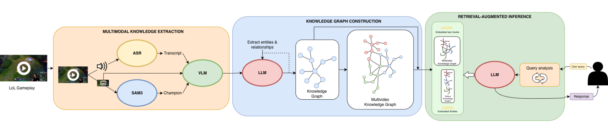

# Multiagent video analysis system

This repository is a research and implementation workspace for multiagent video analysis, with a production-oriented League of Legends RAG pipeline as the main active system. The codebase combines video ingestion, multimodal extraction, entity matching, graph/vector knowledge building, sanitized retrieval, API serving, frontend chat, evaluation datasets, and experimental model/playground work.

The main system today is **Multimodal LoL-RAG**: a League of Legends gameplay QA pipeline that turns videos into sanitized multimodal knowledge artifacts and answers user questions from grounded evidence.



## Repository Map

- `knowledge_pipeline/`: end-to-end queue orchestration for extraction, sanitization, build, and inference-ready artifacts.
- `knowledge_extraction/`: multiagent video extraction with entity matching, ASR, VLM frame descriptions, and segment summarization.
- `knowledge_sanitization/`: pre-build and post-build cleaning, normalization, quarantine, and report generation.
- `knowledge_build/`: chunking, vector indexing, graph construction, entity/relation extraction, and global graph merge.
- `knowledge_inference/`: sanitized-cache-only retrieval, reranking, context building, grounded answer generation, and confidence/debug payloads.
- `knowledge_api_server/`: FastAPI wrapper around the inference service.
- `knowledge_frontend/`: Next.js chat frontend for querying the system.
- `knowledge_system_evaluation/`: evaluation/reporting scripts for generated answers, RAG outputs, and metric comparisons.
- `qa_datasets/`: champion-specific QA evaluation datasets.
- `docs/`: architecture diagrams and detailed phase documentation.
- `chatbot_system/`: older MCP chatbot implementation with tool servers and a previous knowledge-graph video pipeline.
- `playground/`: experiments for VLMs, ASR, GPT-OSS, Qwen, InternVL, SAM3, DINOv2 matching, VideoRAG, and prototype RAG logic.
- `ImageBind/`, `dinov2/`, `sam3/`, `Real-ESRGAN/`, `VideoRAG/`: local research/model dependencies and reference projects used during experimentation.

Generated caches, downloaded models, and virtual environments are present in the workspace but are not the core source layout. Examples include `knowledge_build_cache_*`, `knowledge_sanitization/cache/`, `gpt-oss-20b/`, `.next/`, `node_modules/`, and `venv_*`.

## Main System: Multimodal LoL-RAG

The LoL-RAG pipeline turns queued gameplay videos into a sanitized, queryable knowledge base.

At a high level:

1. `knowledge_extraction/` converts each video into multimodal JSON artifacts.
2. `knowledge_sanitization/pre_build.py` cleans extraction outputs before graph construction.
3. `knowledge_build/` builds chunk stores, vector indexes, and per-video/global knowledge graphs.
4. `knowledge_sanitization/post_build.py` cleans build outputs and rebuilds retrieval indexes from sanitized data.
5. `knowledge_inference/` serves questions from sanitized caches only.
6. `knowledge_api_server/` and `knowledge_frontend/` expose the system as a chat app.

### Extraction

`knowledge_extraction/` is the video understanding layer. It splits videos into segments, samples frames, detects champion identities from HUD regions, transcribes audio, generates frame-level VLM descriptions, and summarizes segment-level events.

The heavy work is split across MCP-style subprocess servers:

- `knowledge_extraction/entity_server.py`: SAM3 + DINOv2/NanoVectorDB champion matching.
- `knowledge_extraction/vlm_asr_server.py`: ASR and visual-language frame descriptions.
- `knowledge_extraction/segment_summarization_server.py`: GPT-OSS segment summarization through `llama_cpp`.

Outputs are written under:

- `knowledge_extraction/cache/extracted_data/<video_name>/`


### Sanitization

`knowledge_sanitization/` enforces the data contract between extraction, build, and inference. It removes prompt/meta contamination, normalizes champion/entity-like names, validates segment/frame structure, cleans graph artifacts, and writes reports plus quarantine logs.

Important output roots:

- `knowledge_sanitization/cache/sanitized_extracted_data/`
- `knowledge_sanitization/cache/sanitized_build_cache_<video_name>/`
- `knowledge_sanitization/cache/sanitized_global/`

Inference is intentionally constrained to sanitized artifacts only.

### Build

`knowledge_build/` turns sanitized extraction outputs into retrieval assets:

- `kv_store_text_chunks.json`
- `vdb_chunks.json`
- `vdb_entities.json`
- `graph_chunk_entity_relation.graphml`
- `graph_chunk_entity_relation_clean.graphml`
- `knowledge_build_cache_global/graph_AetherNexus.graphml`

The build phase chunks segment content, embeds chunks/entities, extracts graph relations with GPT-OSS, cleans per-video graphs, and merges them into the global graph.


### Inference

`knowledge_inference/` is the serving-time RAG layer. It loads only sanitized per-video caches and the sanitized global graph, then runs query analysis, dense/graph/visual retrieval, reranking, context construction, answer generation, and confidence/debug reporting.

CLI example:

```bash
source venv_smolvlm/bin/activate
python -m knowledge_inference.cli --query "What happened around the first dragon fight?" --debug
```


## Running the Main Pipeline

The end-to-end queue runner is:

- `knowledge_pipeline/run_full_queue.py`

It scans `downloads/queue/` and runs extraction, pre-build sanitization, build, and post-build sanitization for each video.

Recommended setup:

```bash
cp knowledge_pipeline/deploy/.env.example .env
set -a
source .env
set +a

bash knowledge_pipeline/deploy/setup_envs.sh
bash knowledge_pipeline/deploy/download_models.sh
python3 knowledge_pipeline/deploy/validate_assets.py
```

Dry run:

```bash
source venv_smolvlm/bin/activate
python -m knowledge_pipeline.run_full_queue --dry-run
```

Full queue:

```bash
source venv_smolvlm/bin/activate
python -m knowledge_pipeline.run_full_queue
```

Useful variants:

```bash
python -m knowledge_pipeline.run_full_queue --force
python -m knowledge_pipeline.run_full_queue --video "<video_basename>"
python -m knowledge_pipeline.run_full_queue --continue-on-error
```

## Required Champion Vector Database

The extraction stage requires the champion reference vector database:

- `knowledge_extraction/image_matching/lol_champions_square_224.nvdb`

If this file is missing, the system cannot perform the champion/entity matching needed by the extraction pipeline. Rebuild it with:

```bash
source venv_smolvlm/bin/activate
python knowledge_extraction/image_matching/build_db_vlm_context_v7.py
```

The script reads champion assets from `knowledge_extraction/image_matching/assets/champions` and writes the NanoVectorDB file used by `knowledge_extraction/entity_server.py`.

## API And Frontend

`knowledge_api_server/` exposes the inference service through FastAPI:

```bash
source venv_smolvlm/bin/activate
uvicorn knowledge_api_server.main:app --host 0.0.0.0 --port 8000
```

The API exposes:

- `POST /chat`

Example request:

```json
{
  "query": "How does Pyke secure kills in this guide?",
  "debug": true
}
```

`knowledge_frontend/` is a Next.js chat UI:

```bash
cd knowledge_frontend
npm install
npm run dev
```

Production build:

```bash
cd knowledge_frontend
npm install
npm run build
npm run start -- --hostname 0.0.0.0 --port 3000
```

Current deployment assumptions:

- `knowledge_frontend/app/page.tsx` sends requests to `http://localhost:8000/chat`
- `knowledge_api_server/main.py` allows CORS from `http://localhost:3000`

Update those if the frontend and API are deployed on different hosts or behind a proxy.

## Evaluation

`knowledge_system_evaluation/` and `qa_datasets/` support offline evaluation of generated answers. The evaluation workspace includes scripts to fill RAG answers and contexts from `knowledge_inference.InferenceService`, compare outputs against gold answers, and run metrics such as ROUGE, BERTScore, and RAGAS-based judgments.

Relevant files:

- `knowledge_system_evaluation/fill_report_eval_test_rag.py`
- `knowledge_system_evaluation/evaluation.py`
- `knowledge_system_evaluation/gpt_oss_eval.py`
- `qa_datasets/*_QA_Eval.json`

## Legacy MCP Chatbot

`chatbot_system/` contains an older MCP-based chatbot system. It includes:

- `chatbot_system/mcp_chatbot.py`: interactive tool-using chatbot.
- `chatbot_system/media_processing_tool.py`: ASR/VLM media processing server.
- `chatbot_system/videogame_search_tool.py`: videogame search tool integration.
- `chatbot_system/knowledge_graph/`: earlier knowledge-graph RAG implementation.
- `chatbot_system/gpu_manager.py`: model/GPU lifecycle helper.

This subsystem is useful historical context and may still be runnable, but the current main pipeline lives under `knowledge_*`.

## Experiments And Research Dependencies

`playground/` is the experimentation area. It includes one-off tests and prototypes for:

- GPT-OSS through `llama_cpp`
- InternVL and Qwen VLM variants
- SmolVLM and Whisper ASR tests
- SAM3/DINOv2 champion and image matching
- early graph-RAG build/query prototypes
- model diagnostics and GPU sanity checks

The repo also contains local copies or checkouts of research/model projects used while developing the system:

- `dinov2/`
- `sam3/`
- `ImageBind/`
- `Real-ESRGAN/`
- `VideoRAG/`

Treat these as support/reference dependencies unless you are actively working on the matching, visual feature, or experimental video-analysis components.

## Documentation

Detailed phase docs live under `docs/`:

- `docs/knowledge_extraction_phase.md`
- `docs/knowledge_sanitization_phase.md`
- `docs/knowledge_build_phase.md`
- `docs/knowledge_inference_phase.md`
- `docs/knowledge_system_evaluation_phase.md`

The most useful system-specific README is:

- `knowledge_pipeline/README.md`

Deployment-specific notes are in:

- `knowledge_pipeline/deploy/README.md`
- `knowledge_pipeline/deploy/SMOKE_TESTS.md`

## Development Notes

- The main pipeline is GPU-heavy and expects CUDA for practical throughput.
- Multiple virtual environments are used because model stacks have conflicting dependencies.
- `venv_smolvlm`, `venv_internVL`, and `venv_gpt` are the current deployment bundle environments.
- Generated caches can be large and are not source-of-truth documentation.
- Sanitized artifacts are the serving source of truth for LoL-RAG inference.
